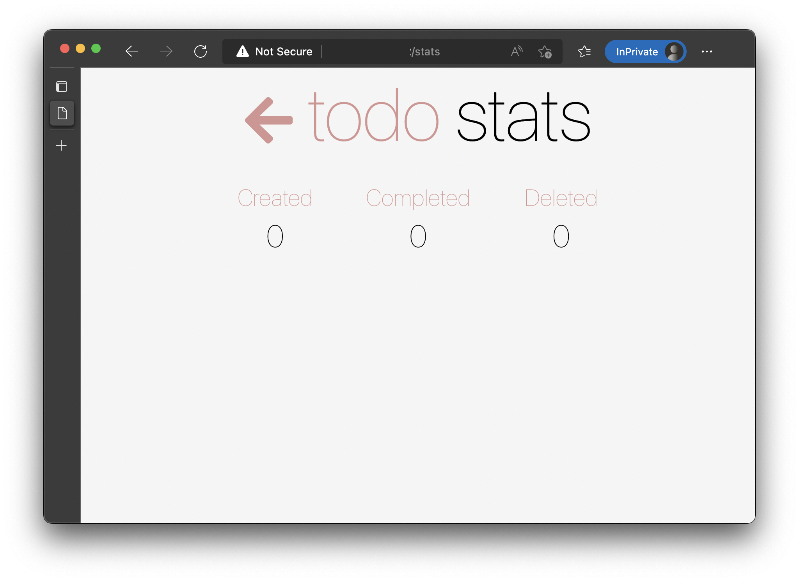

# TODO Application Sample

NOTE: This sample project is adapted from https://github.com/microsoft/mindaro/tree/master/samples/todo-app .

## Setup Steps

### 1. Install devkit

```
$ go install github.com/Azure/forge/devkit/cmd/devkit
```

This step will build the devkit client binary in `<path-to-go-path>/bin/devkit`.

### 2. Clone this repo

```
$ git clone https://github.com/forge-demo/todo-app-demo.git
$ cd todo-app-demo
```

### 3. Connect to a Kubernetes cluster and create a namespace

```
$ kubectl create ns devkit-todo-app-demo
namespace/devkit-todo-app-demo created
```

### 4. Deploy this todo-app demo

```
$ kubectl -n devkit-todo-app-demo apply -f deployment.yaml
...omitted output
```

Wait a couple of minutes to wait for pod start up:

```
$ kubectl -n devkit-todo-app-demo get pods
NAME                            READY   STATUS    RESTARTS   AGE
NAME                            READY   STATUS    RESTARTS      AGE
database-api-69b87c7bd8-z6976   1/1     Running   0             23s
frontend-5865c6f8df-kxsmx       1/1     Running   0             24s
stats-api-5dc6dcb667-gf8j7      1/1     Running   0             25s
stats-cache-55494d9d48-zfhsl    1/1     Running   0             27s
stats-queue-5c9d6c5597-skbjk    1/1     Running   0             26s
stats-worker-b745b6cd9-64mr2    1/1     Running   2 (16s ago)   26s
todos-db-698dc6d64-vdn2g        1/1     Running   0             25s
```

Then get the service IP for the frontend service:

```
$ kubectl -n devkit-todo-app-demo get svc frontend
NAME       TYPE           CLUSTER-IP    EXTERNAL-IP     PORT(S)        AGE
frontend   LoadBalancer   10.0.42.147   <a-public-ip>   80:30994/TCP   51m
```

And open the frontend service in a browser with `http://<a-public-ip>/stats`.
If you can see a todo app similar to below in the browser, this means the demo is working:



## Devkit Usage Steps

### 0. Setup devkit

This demo has been setup with the devkit settings in below:

- `.devkit/` directory: store the devkit configs
- `.devkit-root`: specifies the root of the project (we only want to sync this demo folder for now)

### 1. Spawn devkit environment

```
# NOTE: this command might take a while for initial run as we need to sync the whole folder to remote...
$ devkit go --namespace devkit-todo-app-demo
✅ devkit pod devkit-todo-app-demo/stats-api is ready
✅ forwarding remote ports to local
✅ workspace sync finished
✅ connected
devkit ➜ /workspace $ ls
README.md  database-api  deployment.yaml  frontend  images  license.md  stats-api  stats-worker
```

If you can see output like above, which means now you have entered the devkit environment successfully.

This environment runs in the remote cluster as a pod, providing:

- builtin tool chains, based on your project language (nodejs in our example)
- shell access, where we can run commands as in local
- automatically code sync from local to remote: we will edit the code from local then run in remote

### 2. Start `stats-api`

```
devkit ➜ /workspace $ cd stats-api
devkit ➜ /workspace/stats-api $ npm run start
...omitted output

> todo-stats-api@1.0.0 start
> node server.js

Listening on port 3001
```

Now the process is up and listening on port 3001.

### 3. "Bridge" `stats-api` service

Now open another terminal and run the following command:

```
$ devkit wire --namespace devkit-todo-app-demo
wiring services...
wired service "stats-api" in cluster
forwarded port(s):
  - 3001 -> 3001
to local
all set, stop with ctrl+c
```

This command:

- redirects the `stats-api` service traffic to the dev pod
- forwards dev pod's 3001 port to local

Now, go back to the browser and refresh the "stats" page: you should be able to see some logs from the first terminal:

```
request for stats received with kubernetes-route-as header: undefined
sending back response: {"todosCreated":0,"todosCompleted":0,"todosDeleted":0}
```

which means the requests have been served from the `stats-api` pod. 

### 4. Make code change

Now everything is ready and we can make some code changes. For instance, we edit the `stats-api/server.js` in local:

```diff
     var resp = {
         todosCreated: created || 0,
-        todosCompleted: completed || 0,
+        todosCompleted: completed || 42,
         todosDeleted: deleted || 0,
     };
```

Then we can restart the process in the devkit shell using `ctrl-c`, then rerun:

```
^C
devkit ➜ /workspace/stats-api $ npm run start
...omitted output
```

Now the process is using the updated code - we can verify by refreshing from browser, which should show the updated numbers:


While in the dev pod shell:

```
sending back response: {"todosCreated":"0","todosCompleted":42,"todosDeleted":0}
```

### 5. Clean up

After making the code changes and debugging, we can exit the devkit shell by `exit` and stop the wire process with `ctrl-c`. Now if we refresh the stats page, we should see the page is back to original state.

---

That's it! Now you have a basic understanding of how to use devkit. To learn more, please check out devkit's doc 📑.